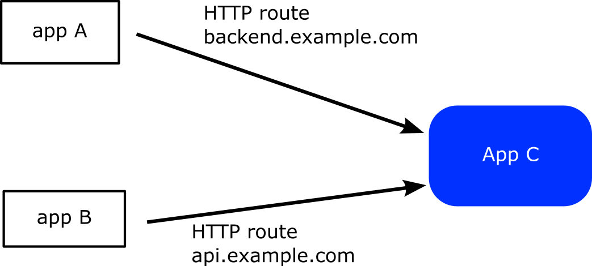

# Using Multiple Routes

The Gateway plugin can control more than one HTTP routes during a canary.
This is a very common scenario if you have micro-services and the same application can be accessed by different routes.




As an  example you have application A that uses application C at `backend.example.com` while application B also depends on C but this time as `api.example.com`

You want to perform a canary deployment for application C so it is crucial that during the canary both HTTP routes change weights.

First you define the two HTTP routes

```yaml
---
kind: HTTPRoute
apiVersion: gateway.networking.k8s.io/v1beta1
metadata:
  name: backend-route
  namespace: default
spec:
  parentRefs:
    - name: eg
  hostnames:
    - backend.example.com  
  rules:
  - matches:
    - path:
        type: PathPrefix
        value: /
    backendRefs:
    - name: argo-rollouts-stable-service
      kind: Service
      port: 80
    - name: argo-rollouts-canary-service
      kind: Service
      port: 80
---
kind: HTTPRoute
apiVersion: gateway.networking.k8s.io/v1beta1
metadata:
  name: api-route
  namespace: default
spec:
  parentRefs:
    - name: eg
  hostnames:
    - api.example.com     
  rules:
  - matches:
    - path:
        type: PathPrefix
        value: /
    backendRefs:
    - name: argo-rollouts-stable-service
      kind: Service
      port: 80
    - name: argo-rollouts-canary-service
      kind: Service
      port: 80
```

Then in your Rollout definition you use the `httproutes` property that
accepts a list of routes to be controlled.

```yaml
apiVersion: argoproj.io/v1alpha1
kind: Rollout
metadata:
  name: rollouts-demo
  namespace: default
spec:
  replicas: 5
  strategy:
    canary:
      canaryService: argo-rollouts-canary-service
      stableService: argo-rollouts-stable-service
      trafficRouting:
        plugins:
          argoproj-labs/gatewayAPI:
            httpRoutes:
              - name: backend-route
              - name: api-route
            namespace: default
      steps:
      - setWeight: 10
      - pause: {}
      - setWeight: 50
      - pause: {}
      - setWeight: 100
      - pause: {}
  revisionHistoryLimit: 2
  selector:
    matchLabels:
      app: rollouts-demo
  template:
    metadata:
      labels:
        app: rollouts-demo
    spec:
      containers:
        - name: rollouts-demo
          image: <my-image:my-tag>
          ports:
            - name: http
              containerPort: 8080
              protocol: TCP
```              

If you now start a canary deployment both routes will change to 10%, 50% and 100% as the canary progresses to all its steps.